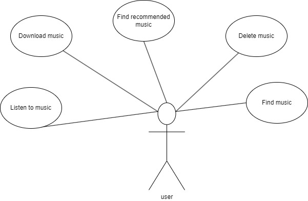
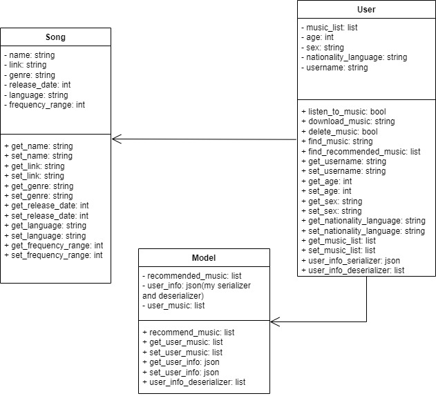

# Music Player 

## Brief description ##
Simple music player with recommendation system.

## Developer of the project ##
Vadim Zhur, group 153505

## Architecture of the application ##
### Use-case diagram ###

### uml diagram ###

## Main functions of the application ##
 * Listen to music
 * Download music
 * Find music
 * Delete music
 * Find recommended music
